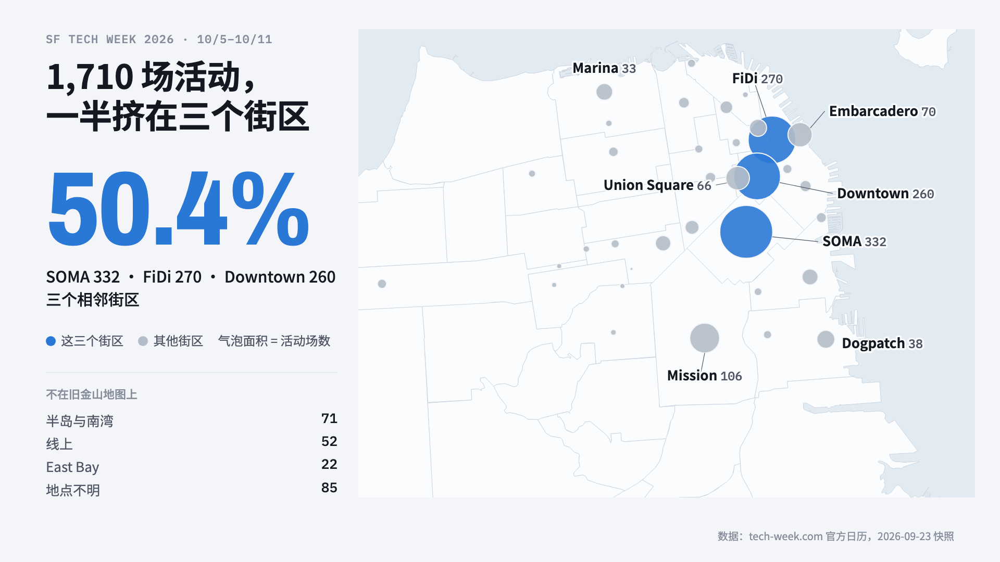
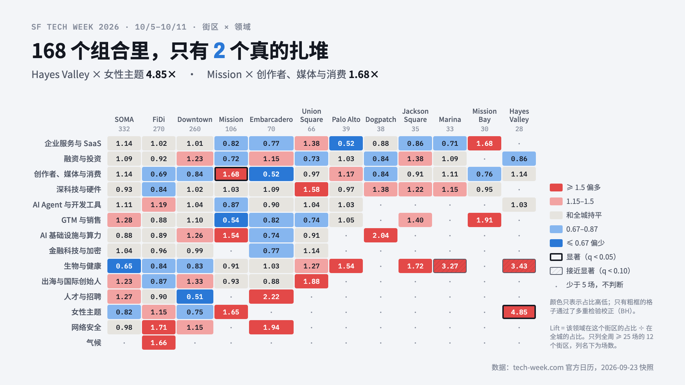

# SF Tech Week 2026 Event Map

[Explore the live overview](https://lilyshen-sudo.github.io/sf-tech-week-Oct/) · [Open the interactive map](https://lilyshen-sudo.github.io/sf-tech-week-Oct/map.html) · [View the figure gallery](https://lilyshen-sudo.github.io/sf-tech-week-Oct/figures.html)

**1,710 events, one week, and no single venue.** This project turns a snapshot of the [official SF Tech Week calendar](https://www.tech-week.com/calendar/sf) into a neighborhood map, a time explorer, and a test of whether related events actually cluster.

The calendar snapshot was collected on September 23, 2026. It contains 1,714 listings; 1,710 remain after limiting the analysis to October 5–11 and removing one duplicate. The site is a historical snapshot, not a live registration feed.

---

## Problem and Goal

The official calendar is useful for finding individual events, but the week is hard to understand as a whole. Events span seven days, many topics and formats, and dozens of location labels. The public records identify a neighborhood or broad area, not a reliable venue coordinate.

**The goal is to make the week explorable without inventing precision.** The map groups events by the neighborhood supplied by the host. A second view lets people filter by day, topic, start hour, registration status, search term, and current map area. An analysis view asks a different question: is a topic unusually common in a neighborhood, or does that neighborhood simply host many events of every kind?





The [overview](https://lilyshen-sudo.github.io/sf-tech-week-Oct/), [interactive street map](https://lilyshen-sudo.github.io/sf-tech-week-Oct/map.html), and [figure gallery](https://lilyshen-sudo.github.io/sf-tech-week-Oct/figures.html) all read the same prebuilt `web/data.js` file. You can also run them with a local server using the instructions below.

---

## Architecture

```text
  SOURCE       SF Tech Week calendar snapshot    DataSF neighborhood boundaries
                        │                                   │
                        ▼                                   │
  PREP         infer audience → clean and deduplicate       │
               map official tags to 14 overlapping domains │
                        │                                   │
                        ▼                                   │
  ANALYSIS     neighborhood / day / hour summaries          │
               hypergeometric tests + BH correction         │
                        └─────────────────┬─────────────────┘
                                          ▼
  BUILD        web/build_data.py → web/data.js
               compact event rows · bitmasks · centers · simplified shapes
                                          │
                        ┌─────────────────┼──────────────────┐
                        ▼                 ▼                  ▼
  VIEW            overview SVG       MapLibre map       figure gallery
                  web/index.html     web/map.html       web/figures.html
```

The browser does not fetch the official calendar or run the statistical tests. Python processes one dated snapshot, then the static pages filter and draw the result. This keeps the views consistent and makes every displayed count traceable to the same 1,710 event set.

The map uses one bubble per location label, with clustering as the map zooms out. A bubble is placed at an approximate neighborhood center; it is **not** an event address. Virtual and unknown locations have no map coordinate, while broader Bay Area labels are presented separately or approximately.

---

## Tech stack

| Layer | Implementation |
|---|---|
| Data processing | Python, pandas, NumPy |
| Statistical analysis | SciPy hypergeometric survival function; Benjamini–Hochberg correction |
| Static visualizations | Plain HTML, CSS, JavaScript, SVG |
| Interactive map | MapLibre GL JS 4, OpenFreeMap light/dark basemaps |
| Neighborhood reference | DataSF Analysis Neighborhoods GeoJSON |
| Figure export | Headless Google Chrome via `analysis/export_figures.sh` |

There is no frontend build step. GitHub Pages publishes only `web/` through the [deployment workflow](.github/workflows/deploy-pages.yml). MapLibre and the basemap load from the network; the overview and figure gallery draw their own SVG from the packaged data file.

---

## Data flow

1. **Capture.** The September 23 calendar snapshot records public event fields and official theme, format, and curated-track labels. The browser-side capture script was not retained.
2. **Infer and clean.** `data/infer_audience.py` adds a rule-based audience guess. `analysis/analyze.py` normalizes names and location labels, flags out-of-week rows, removes duplicate name/date/time listings, and marks 00:00–05:59 start times as uncertain.
3. **Group and test.** Official themes and tracks are mapped to 14 project domains. Domains can overlap. For neighborhoods with at least 25 physical events, the analysis computes domain lift and a one-sided hypergeometric p-value; it corrects the 168 comparisons with Benjamini–Hochberg. A significant cell also needs at least five events.
4. **Package.** `web/build_data.py` combines the clean CSV, analysis tables, approximate location centers, and simplified DataSF boundaries into `web/data.js`. Events are compact arrays; domain and theme membership use bitmasks.
5. **Explore.** The overview and map apply filters in the browser. The lift matrix uses the precomputed full-week test results rather than recalculating significance from a filtered subset.

`audience_inferred` is a project estimate, **not** an official per-event audience field. Host-selected topics are also not an independent classification of event quality.

---

## Evaluation

I checked the prebuilt browser data against the analysis outputs:

| Check | Result |
|---|---:|
| Original calendar rows | 1,714 |
| In-week rows, after one duplicate is removed | 1,710 |
| Rows with a usable start hour | 1,706 |
| Neighborhood labels / mapped boundary shapes | 45 / 41 |
| SOMA + FiDi + Downtown | 862 events, 50.4% of the analysis set |
| Starts at 17:00 or 18:00 | 684 events, 40.1% of usable start times |
| Significant neighborhood × domain pairs | 2 of 168 |

The two significant pairs are **Mission × Creator, Media & Consumer** (39 of 106 neighborhood events; lift 1.68, adjusted q 0.0306) and **Hayes Valley × Women-focused** (7 of 28; lift 4.85, q 0.0306). Some other cells have high lift but do not meet the corrected threshold; the interface distinguishes those from significant clusters.

Earlier browser checks also compared the map's hour and domain filters with the CSV and exercised map selection, clearing filters, hour playback, language switching, and light/dark themes. There is no automated test suite in this repository.

---

## Project structure

```text
web/
  index.html             neighborhood and time overview
  map.html               interactive street map, event list, and insights
  figures.html           exportable chart layouts
  data.js                prebuilt data shared by all three pages
  build_data.py          compiles cleaned data and map shapes

analysis/
  analyze.py             cleaning, summaries, and statistical tests
  out/                   generated analysis tables
  figures/               exported PNGs
  export_figures.sh      batch figure export on macOS

data/                    local source and cleaned snapshots (Git ignored)
docs/                    local project documentation (Git ignored)
docs-local/              local content planning (Git ignored)
```

The public repository includes the pages, prebuilt `web/data.js`, analysis code and tables, and exported images. The `data/`, `docs/`, and `docs-local/` directories are intentionally excluded by `.gitignore`. A fresh clone can display the existing snapshot but cannot rebuild or independently audit the source extraction without the local data files.

---

## Quick start

From the repository root:

```bash
cd web
python3 -m http.server 8000
```

Open [http://localhost:8000/index.html](http://localhost:8000/index.html) for the overview or [http://localhost:8000/map.html](http://localhost:8000/map.html) for the street map. The street basemap, MapLibre, and web fonts require internet access; the event data is served locally from `data.js`.

To rebuild **only if you have the local, Git-ignored `data/` snapshot**, install `numpy`, `pandas`, and `scipy`, then run from the repository root:

```bash
python3 data/infer_audience.py
python3 analysis/analyze.py
python3 web/build_data.py
```

On macOS with Google Chrome installed, `zsh analysis/export_figures.sh` regenerates the PNG figures after `web/data.js` is rebuilt.

---

## Optimize

**Build once, filter locally.** The site loads one roughly 513 KB data file instead of querying and reaggregating the calendar on each interaction. Domain and theme membership are stored as bitmasks, while the neighborhood boundary paths are simplified during the Python build.

**Keep the list responsive.** The map clusters neighborhood bubbles as it zooms out. The event sidebar reveals rows in batches of 120, and the same filter state drives the map, list, count, and status strip.

---

## Design decisions and known limits

- **Neighborhood bubbles instead of event pins.** The public calendar does not reliably expose venue coordinates. Several calendar labels overlap or do not match DataSF polygons one to one, so a precise point or choropleth would overstate the data.
- **A dated static snapshot instead of live API calls.** The visualization is fast to open and its findings are reproducible for this snapshot, but names, registration states, and counts may change on the official calendar.
- **Precomputed tests instead of color alone.** Lift describes relative concentration; significance depends on sample size and multiple-testing correction. The matrix shows counts and marks the two corrected results explicitly.
- **Rebuildability is limited by the ignored source data.** The published repository intentionally omits the raw and clean event snapshots and the capture script. The analysis scripts document the transformations, while `web/data.js` preserves the rendered snapshot.

Sources: [SF Tech Week calendar](https://www.tech-week.com/calendar/sf) for events and [DataSF Analysis Neighborhoods](https://data.sfgov.org/) for the boundary reference. The map uses [OpenFreeMap](https://openfreemap.org/) and OpenStreetMap contributors for its street basemap.
