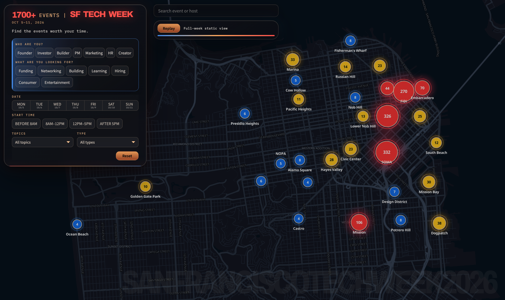

# SF Tech Week 2026 Event Intelligence Map

[Open the interactive map](https://sf-tech-week-oct-web.vercel.app/)

## Introduction

**1,700+ events, one week, and no single venue.** This project turns a snapshot of the official SF Tech Week calendar into a neighborhood-first event map with inferred audience and intent filters, public Partiful links, visible guest-count signals, and a replay of how the week unfolds over time.

The site is a historical snapshot, not a live registration feed. Event locations are based on host-supplied neighborhood labels, so map circles represent approximate neighborhood centers rather than venue-level addresses.



<video src="assets/sf-tech-week-2026.mov" autoplay muted loop playsinline width="100%"></video>

[Watch the map replay video](assets/sf-tech-week-2026.mov)

## Product Goal

The official calendar is useful for finding individual events, but it is hard to understand the week as a whole. This map is designed to answer four questions quickly:

- Where is activity concentrated?
- How does the week unfold from October 5 to October 11?
- Which events are relevant to founders, investors, builders, marketers, creators, and other audiences?
- What is the main intent of an event: funding, networking, building, learning, consumer, hiring, or entertainment?

The project avoids false precision: neighborhood bubbles are approximate, and `audience_inferred` / `intent_inferred` are project estimates rather than official Tech Week fields.

## Map Experience

The main experience lives in `web/index.html`.

- **Intro replay:** the map opens with an automatic timeline animation from the first timed event to the last timed event.
- **Replay after filtering:** choosing any left-side filter switches to a static filtered view; pressing `Replay` animates that selected subset.
- **Neighborhood density:** blue, yellow, and red circles show event density per neighborhood.
- **Personal filters:** role and goal filters help narrow the week by audience and intent.
- **Event discovery:** search by event or host, filter by date, time, topic, and type, then open the public Partiful event page.
- **Neighborhood signal:** clicking a circle opens a right-side drawer with top theme mix and visible events for that area.

## Quick Start

From the repository root:

```bash
cd web
python3 -m http.server 8000
```

Open:

```text
http://localhost:8000/
```

The basemap, MapLibre, and web fonts require internet access. The event payload is served locally from `web/data.js`.
